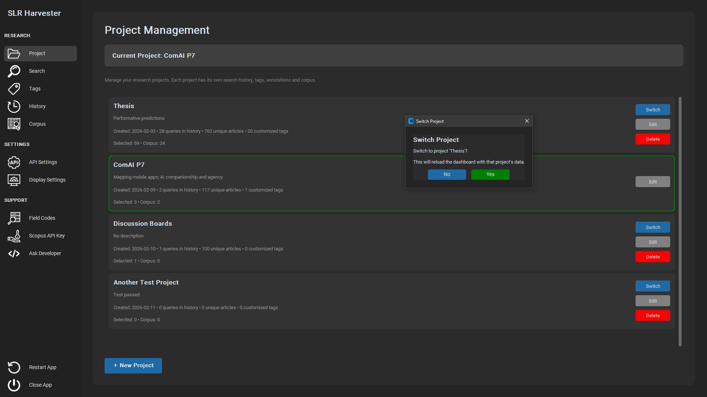
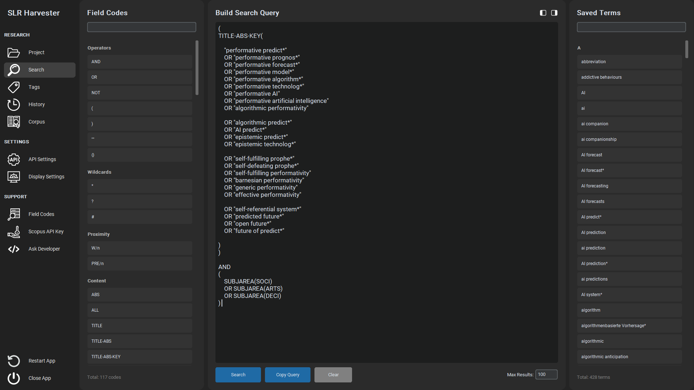
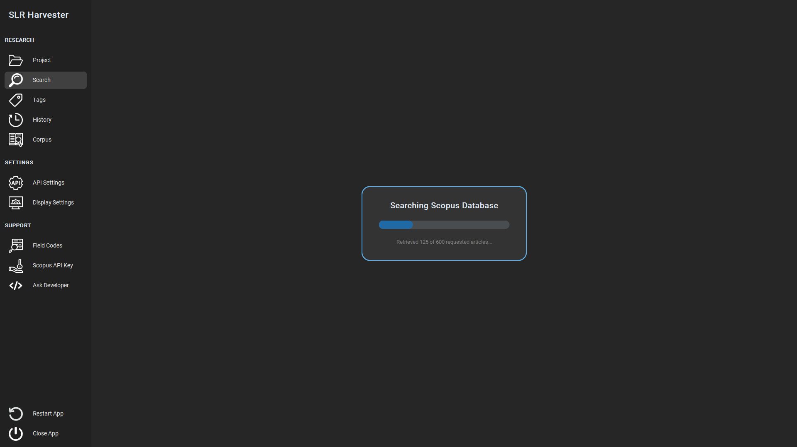
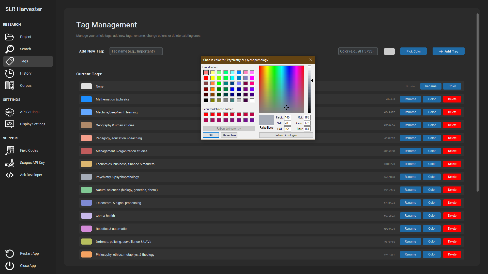
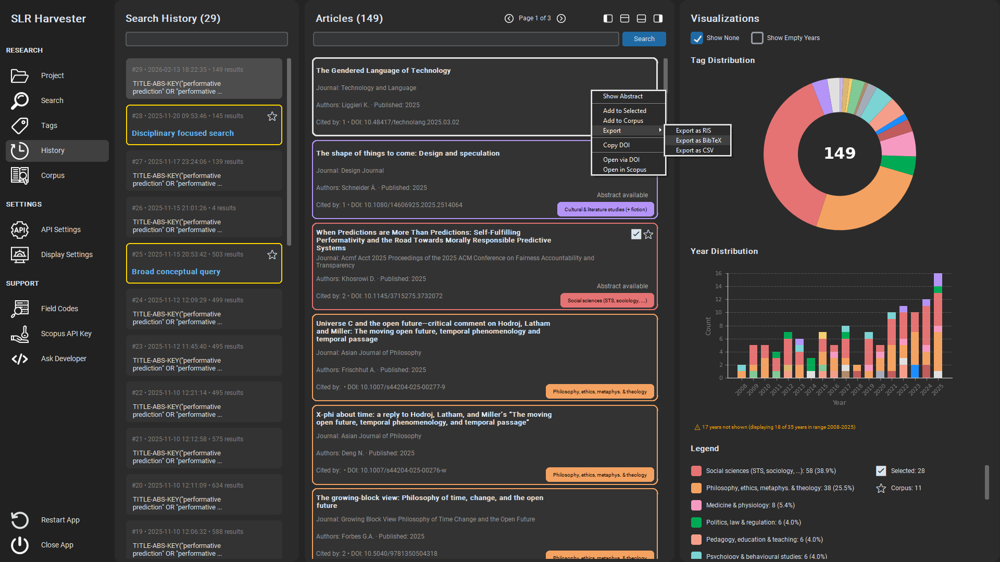
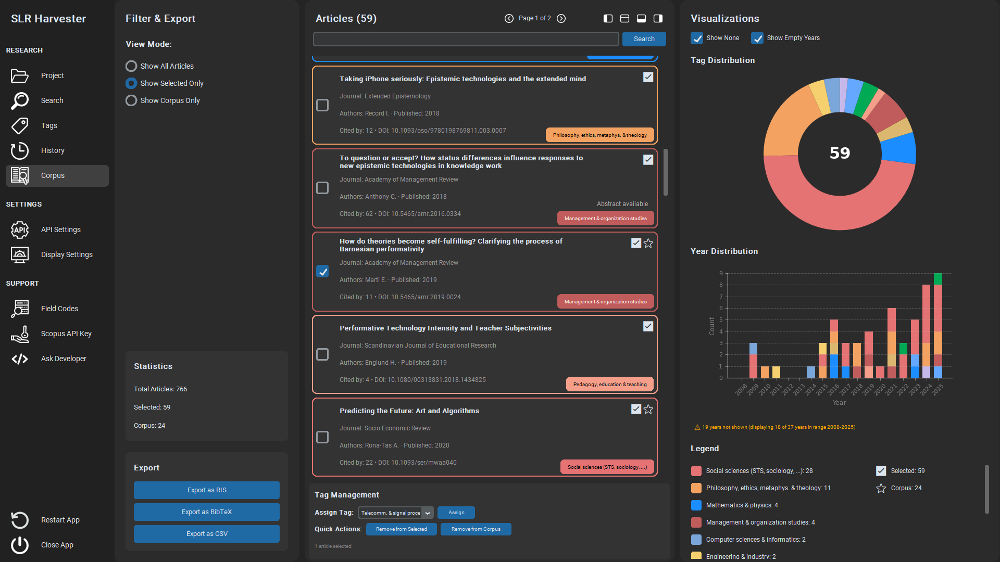

# Usage Guide

This guide walks through core workflows with screenshots.

## Before You Start

- Request a Scopus API Key on Elsevier's Developer Portal.
- Open the app’s API Settings and paste your API Key (and InstToken, if available) and Save.
- Configuration is stored in `slr_config.json` in the repository root.

Note: The file `slr_config.json` is created or updated when you click "Save" in the API Settings after entering your API Key (and optional InstToken). It typically looks like this:

```json
{
  "APIKey": "YOUR-API-KEY",
  "InstToken": "",
  "View": "STANDARD"
}
```

Valid values for "View": `STANDARD` (default) or `COMPLETE`.

## Create a Project

- Open the Project view and create a new project.
- The app creates a dedicated subfolder under `projects/` named with a timestamp (e.g., `20260115_143522`).
- You can rename the project name and description later; the folder path remains stable.



## Build Your Search (Search view)

- Compose your Scopus query with field codes and boolean operators on the left, and your own search terms in the editor.
- When you run searches, fragments that are not operators or field codes are saved into the Saved Terms panel for reuse (removable at any time).
- Default page size is 100 per request; increasing of course is possible.




## Tag and Organize (Corpus/History views)

- Define a project‑specific tag set and use bulk tagging.
- Consolidate journals or sources into higher‑level categories (e.g., “Psychology”, “STS”).



## History and Comparisons

- Review query history and compare coverage/focus across result sets.



## Selection and Corpus

- Use two‑stage inclusion: first add promising items to Selected, then move final items to Corpus (both reversible).



## Visualizations and Legend

- Right‑click the doughnut or year chart to open the context menu.
- Choose “Open legend window” to show a popup legend (useful on small screens).
- Export charts as PNG via the same menu.

## Export

- Export `.bib`, `.ris`, or `.csv` files.
- Charts export as `.png`.

