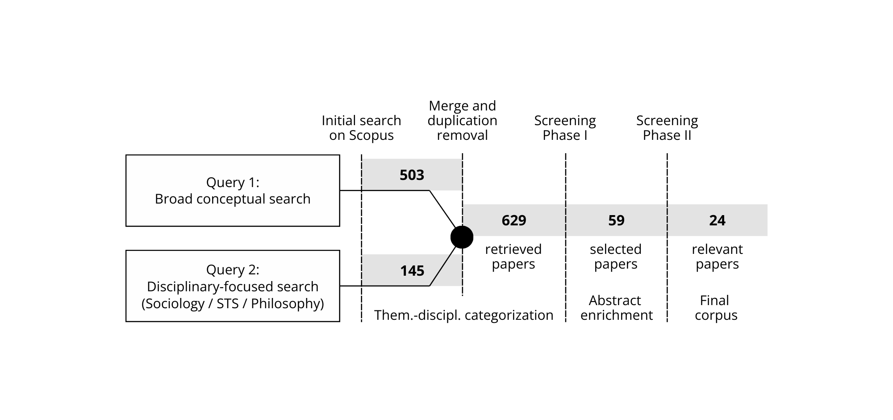

# Workflow Logic

SLR Harvester formalizes SLR screening into a transparent, reproducible process. Visualizations are descriptive and intended for orientation, not for inferential analysis.

## Objective and Scope

- Designed to generate medium‑sized corpora for qualitative downstream analysis.
- Provides persistent, project‑based storage: queries, results, tags, screening states, corpus.
- Not a bibliometric analytics suite or statistical platform.

## Recommended Workflow (without InstToken)

1) Term‑driven retrieval (Search)
   - Capture documents/articles using search terms. Iterate searches to map the field.
2) Iterative query refinement and expansion
   - Evolve and document queries (Query History) to stabilize syntax and coverage; compare across result sets.
3) Project‑specific tagging/marking
   - Apply tags tailored to your project; bulk actions via search; consolidate journals into higher‑level categories (e.g., “Empirical Work", "Psychology”).
4) First‑pass selection (Selected)
   - While tagging and refining, add promising items to Selected as a reversible preliminary inclusion.
5) Manual abstract enrichment (for Selected)
   - Open items in the browser with institutional login; add abstracts manually in SLR Harvester (included in `.bib`/`.ris` exports).
6) Abstract review
   - Review enriched abstracts to assess fit and relevance; adjust tags/notes as needed.
7) Corpus decision
   - Decide which Selected items enter the final Corpus (reversible; transparent decisions).
8) Export and external qualitative analysis
   - Export `.ris`/`.bib`/`.csv`. Complete missing metadata in a reference manager (e.g., Zotero). Conduct qualitative analysis (e.g., MAXQDA).

## Paper Selection Process (Example)

## DOI‑Based Metadata Recovery

- Even when abstracts or full author lists are missing, DOIs are exported reliably.
- After export, use a reference manager (e.g., Zotero “Add Item(s) by Identifier”) to retrieve complete metadata.

## Known Limitations

- No advanced statistical or bibliometric analytics
- No network visualization
- No automated AI classification
- Dependent on Scopus API access configuration; metadata completeness depends on InstToken availability

